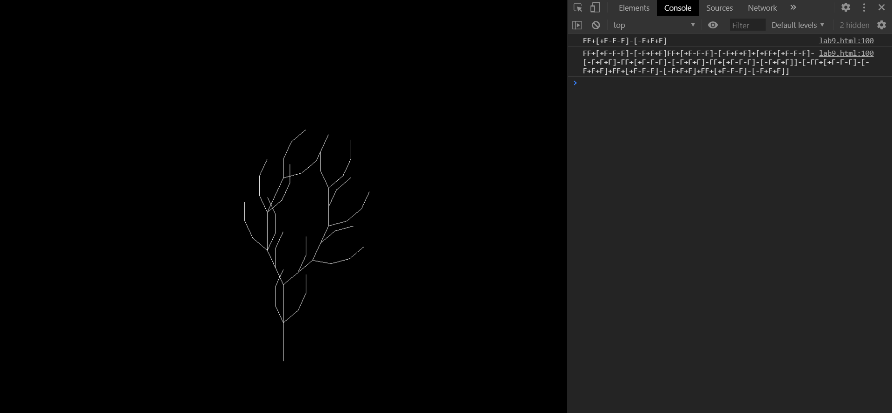

# CMPM163Labs

## Lab 2
https://drive.google.com/file/d/1bGyNadr0rwgjOGOviXEX98w_YDtNyvJW/view?usp=sharing

## Lab 3
https://drive.google.com/file/d/1hypx7C1F3pt6iiIhd0DwOwo-dYjgK3Cw/view?usp=sharing

Cubes from left to right:
1. The original cube. It has the phong material with green specular.
2. I used THREE.MeshPhysicalMaterial() instead of THREE.MeshPhongMaterial. The cube has an emission value of 0x361134, a clearcoat (1.0), high reflectivity (0.9), and 60% opacity.
3. I used THREE.MeshPhongMaterial() like the given example. It has albedo 0xea3788, specular 0xff7f51, and shininess 100 instead of 30.
4. This is the cube that uses the custom color interpolation shader. It interpolates between the two colors specified in its material on the z axis. It uses colorA:0x260d42 and colorB:0x086375.
5. This cube uses a custom shader. It does flat shading, where the color of each face is determined by the face normal. The face color is the sum of the x, y and z colors multiplied by the dot of the face normal and each respective axis. The axis colors are specified in the material. I used 0xff0000, 0x00ff00, and 0x0000ff for x, y, and z for this cube.
6. This cube uses another custom shader. The color of each fragment is taken from a texture (I'm using a rainbow gradient). The u coordinate for each fragment is determined by the dot product of its position and a given "direction." (The v coordinate is always 0). So if you set direction to (0, 0, 1), it would be picking colors based on the z position of each fragment. There is also a "scale" uniform that multiplies the dot product. I update the direction and scale values in my animate function.
7. This sphere uses the same custom shader as the previous cube. I just added it to see how it would look on something more round.

## Lab 4
https://drive.google.com/file/d/1KD9fNM1WVTzZRCSLSRVHViGSguA5zPFW/view?usp=sharing

a. x = min(floor(u * 8), 7)

b. y = min(floor((1 - v) * 8), 7)

c. white

Cubes from left to right:

TOP ROW:
1. (ii) Cube shaded with a texture (163.jpg) and a normal map (163_norm.jpg) using THREE.MeshPhongMaterial material
2. (i) Cube shaded with only the texture (163.jpg) using THREE.MeshPhongMaterial material
3. (iii) Another cube with a texture (161.jpg) and a normal map (176_norm.jpg) using THREE.MeshPhongMaterial material
4. (iv) Unlit cube shaded with a texture (161.jpg) using custom shaders

BOTTOM ROW:
1. (v) Unlit cube shaded with a texture (176.jpg) tiled 2x2 using custom shaders (the ones in the HTML)
2. (v) Unlit cube shaded with a texture (176.jpg) tiled 5x5 using custom shaders (the ones in the HTML)

I solved the cube 5 problem by multiplying the uv coordinates by a scale (textureScale 2 gives you 2x2, 5 gives you 5x5, etc.) and using mod() so it repeats.

## Lab 5
Part 2 a: https://drive.google.com/file/d/1-H-aNcodNrsRdhrgTUB-8j1eAPIC0PnK/view?usp=sharing

Part 2 b explosion: https://drive.google.com/file/d/1pC2sxC6xGIbNhl-Y7ljK7y6ExpU6DqPM/view?usp=sharing

Part 2 b custom: https://drive.google.com/file/d/1P2imYPTNeCddY9r33z5tP6kkPvzSQfoM/view?usp=sharing

For my custom particle effect, I have each particle assigned another particle to follow. Its acceleration is adjusted every frame so it moves towards this other particle. The velocity of the particles is clamped, but the limit increases over time. Each particle's color is determined by its direction of motion.

## Lab 6 (Part 2)

Link to Shadertoy: https://www.shadertoy.com/view/WdBBRR

Here's a neat project someone else made that visualizes audio with a clay pot on a pottery wheel: https://www.shadertoy.com/view/4sf3DB

## Lab 7 (Part 2)
Part 2a:

Here is the textured screenshot. I made it interpolate between two textures based on height.

Here is just the heightmap used as the texture.

Part 2b:

Wavy blue plane:
https://drive.google.com/file/d/10PggDjK78I28tHiREZk6S9UsxX5JmxT2/view?usp=sharing

Creative scene:
https://drive.google.com/file/d/1Qzc0GXu0UQPV2l3XfPAMCXIGzGn8WvkP/view?usp=sharing

My lab partner, Giancarlo Tomasello, did part 1 of this lab. He created a mountain scene with some water moving in gentle waves in little ponds. The scene is divided into two different colors of lighting (by using a color gradient node and position node in Unity shader graph). The distorted mesh floats above the landscape like a little cloud, and it moves back and forth between the two colors.
We didn't help each other with the lab.

## Lab 8 (Part 2)
My procedurally generated city is inspired by various city plans/buildings by Le Corbusier.
Here is a picture of my generated city:

Here is a link to a video: https://drive.google.com/file/d/1KVPudJMeap2e-zOgs7nXWq2JDeFEVqmC/view?usp=sharing

Here are a couple of pictures of his "Plan Voisin," a plan for reconstructing Paris:

Most of the building models I used are based on those seen in the Plan Voisin, and the arrangement of them (the + buildings in a rectangle, the w-like ones around, the rectangle gardens bordering those, etc.) are based on these models. The non-perpendicular roads seen in some of these pictures is why I chose to skew the city tiles.

Here is a picture of his proposed "Obus" plan for the port of Algiers:

This plan included a giant bridge made up of many stories of residential prefabricated rooms and a giant highway lifted high above the ground that meets the top of the bridge. My generated city includes a large bridge structure with a highway ramping up to its top based on this.

The reason I made some of the towers colorful was because of Le Corbusier's "Quartiers Modernes Fruges":

After construction, some of the residents decided to paint their homes in colors to personalize them. I thought bringing this color to my city made it look more interesting.

My lab partner, Daniel Nguyen, also did part 2 of this lab. The most challenging part of the tutorial for him was determining the Y scale of each cube using the noiseData array. The most interesting part of the tutorial for him was how grayscale values from the image were sampled to determine the building scales.
We did not help each other with this lab.

## Lab 9 (Part 2)
Here are screenshots of the tree at different stages (and the sequence text in the console):

